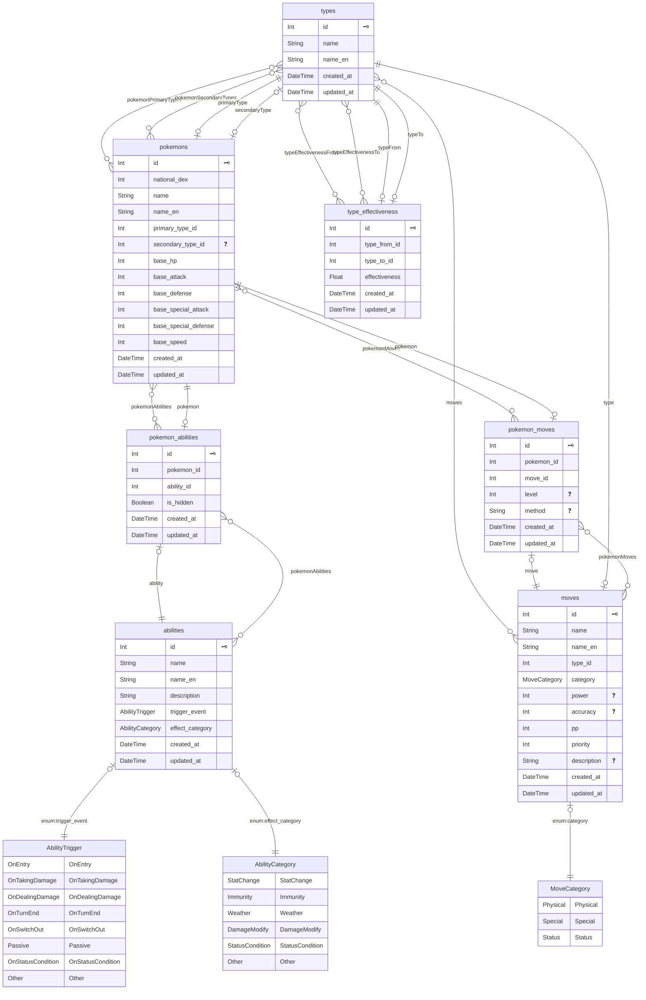

```mermaid
erDiagram

        AbilityTrigger {
            OnEntry OnEntry
OnTakingDamage OnTakingDamage
OnDealingDamage OnDealingDamage
OnTurnEnd OnTurnEnd
OnSwitchOut OnSwitchOut
Passive Passive
OnStatusCondition OnStatusCondition
Other Other
        }
    


        AbilityCategory {
            StatChange StatChange
Immunity Immunity
Weather Weather
DamageModify DamageModify
StatusCondition StatusCondition
Other Other
        }
    


        MoveCategory {
            Physical Physical
Special Special
Status Status
        }
    
  "types" {
    Int id "🗝️"
    String name 
    String name_en 
    DateTime created_at 
    DateTime updated_at 
    }
  

  "pokemons" {
    Int id "🗝️"
    Int national_dex 
    String name 
    String name_en 
    Int primary_type_id 
    Int secondary_type_id "❓"
    Int base_hp 
    Int base_attack 
    Int base_defense 
    Int base_special_attack 
    Int base_special_defense 
    Int base_speed 
    DateTime created_at 
    DateTime updated_at 
    }
  

  "abilities" {
    Int id "🗝️"
    String name 
    String name_en 
    String description 
    AbilityTrigger trigger_event 
    AbilityCategory effect_category 
    DateTime created_at 
    DateTime updated_at 
    }
  

  "moves" {
    Int id "🗝️"
    String name 
    String name_en 
    Int type_id 
    MoveCategory category 
    Int power "❓"
    Int accuracy "❓"
    Int pp 
    Int priority 
    String description "❓"
    DateTime created_at 
    DateTime updated_at 
    }
  

  "type_effectiveness" {
    Int id "🗝️"
    Int type_from_id 
    Int type_to_id 
    Float effectiveness 
    DateTime created_at 
    DateTime updated_at 
    }
  

  "pokemon_abilities" {
    Int id "🗝️"
    Int pokemon_id 
    Int ability_id 
    Boolean is_hidden 
    DateTime created_at 
    DateTime updated_at 
    }
  

  "pokemon_moves" {
    Int id "🗝️"
    Int pokemon_id 
    Int move_id 
    Int level "❓"
    String method "❓"
    DateTime created_at 
    DateTime updated_at 
    }
  
    "types" o{--}o "pokemons" : "pokemonPrimaryTypes"
    "types" o{--}o "pokemons" : "pokemonSecondaryTypes"
    "types" o{--}o "moves" : "moves"
    "types" o{--}o "type_effectiveness" : "typeEffectivenessFrom"
    "types" o{--}o "type_effectiveness" : "typeEffectivenessTo"
    "pokemons" o|--|| "types" : "primaryType"
    "pokemons" o|--|o "types" : "secondaryType"
    "pokemons" o{--}o "pokemon_abilities" : "pokemonAbilities"
    "pokemons" o{--}o "pokemon_moves" : "pokemonMoves"
    "abilities" o|--|| "AbilityTrigger" : "enum:trigger_event"
    "abilities" o|--|| "AbilityCategory" : "enum:effect_category"
    "abilities" o{--}o "pokemon_abilities" : "pokemonAbilities"
    "moves" o|--|| "MoveCategory" : "enum:category"
    "moves" o|--|| "types" : "type"
    "moves" o{--}o "pokemon_moves" : "pokemonMoves"
    "type_effectiveness" o|--|| "types" : "typeFrom"
    "type_effectiveness" o|--|| "types" : "typeTo"
    "pokemon_abilities" o|--|| "pokemons" : "pokemon"
    "pokemon_abilities" o|--|| "abilities" : "ability"
    "pokemon_moves" o|--|| "pokemons" : "pokemon"
    "pokemon_moves" o|--|| "moves" : "move"
```
